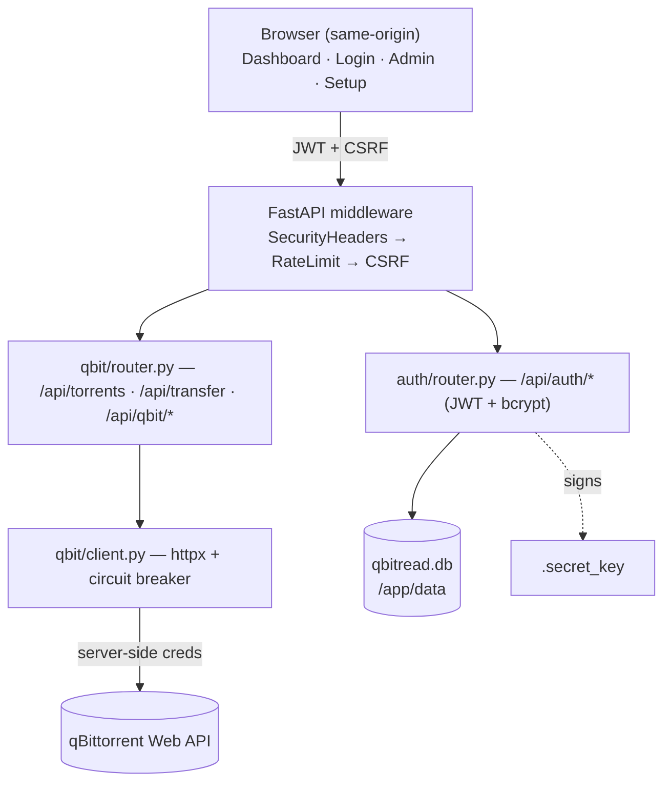

<div align="center">
  
[](https://github.com/JakeWard98/qbitread/actions/workflows/github-code-scanning/codeql)    

</div>

<div align="center">

# qBitRead 

</div>

A lightweight, read-only Docker web app for monitoring your qBittorrent instance. Dark, minimal dashboard with live speeds, progress, ETA, and multi-user authentication.

> **Disclaimer:** This is a personal project built for my own homelab, completely written with Claude AI. It is available for anyone to use, but **use at your own risk**. No warranties or guarantees are provided.

## Features

- **Real-time monitoring** — dashboard polls at a configurable interval (default 5 seconds, adjustable in the admin panel), backing off up to 60 seconds on repeated errors and resetting on reconnect. Values below 5s are not recommended — qBittorrent may rate-limit or block API calls if polled too aggressively
- **Filtering** — All, Downloading, Seeding, Completed, Running, Stopped, Active, Stalled (with live counts)
- **Sortable columns** — Name, Size, Progress, DL/UL Speed, ETA, Ratio, Status
- **Search** — instant case-insensitive filtering by torrent name
- **Multi-user auth** — JWT-based login with admin, monitor, and user roles
- **Admin panel** — create/delete users, change passwords, view qBittorrent connection status, configure dashboard refresh rate
- **Password policy** — 8+ characters, uppercase, lowercase, digit, special character required
- **Weak password detection** — grandfathered passwords flagged with a dashboard banner
- **Setup wizard** — guided first-run setup if no admin password is configured
- **Mobile responsive** — sort dropdown and flexible layouts for smaller screens
- **Read-only by design** — monitors torrents only; never modifies, adds, or deletes them
- **Credential isolation** — qBittorrent credentials never leave the server

## Architecture



The backend is the only component that communicates with qBittorrent. The browser never talks to qBittorrent directly — all requests are proxied through authenticated FastAPI endpoints.

## Quick Start

```bash
# Clone and configure
git clone https://github.com/JakeWard98/qbitread.git
cd qbitread
cp .env.example .env
# Edit .env with your qBittorrent details

# Run with Docker
docker compose up -d

# Open http://localhost:8112
```

If you set `ADMIN_PASSWORD` in `.env`, the admin account is created automatically. Otherwise, a setup wizard guides you through it on first visit.

## Docker Image

Published to GitHub Container Registry with `linux/amd64` and `linux/arm64` support.

```bash
docker pull ghcr.io/jakeward98/qbitread:latest
```

The `/app/data` volume holds two files: `qbitread.db` (SQLite database with all users) and `.secret_key` (auto-generated JWT signing key). Back up this volume before upgrading or migrating.

### Tags

**Stable releases** (e.g. `v1.2.3`):

| Tag | Description |
|-----|-------------|
| `1.2.3` | Exact version — pinned, never changes |
| `1.2` | Latest patch in the `1.2.x` line |
| `1` | Latest minor + patch in the `1.x.x` line |
| `latest` | Most recent stable release |

**Pre-releases** (e.g. `v1.2.3-beta.1`):

| Tag | Description |
|-----|-------------|
| `1.2.3-beta.1` | Exact pre-release version |
| `beta` | Most recent pre-release |

Pre-releases do **not** update `latest`.

## Environment Variables

| Variable | Required | Default | Description |
|----------|----------|---------|-------------|
| `QBIT_HOST` | Yes | — | qBittorrent Web UI URL (e.g. `http://qbit:8080`) |
| `QBIT_USERNAME` | Yes | `admin` | qBittorrent username |
| `QBIT_PASSWORD` | Yes | — | qBittorrent password |
| `SECRET_KEY` | No | auto-generated | JWT signing key. Auto-generated and persisted to the data volume if not set |
| `ADMIN_USERNAME` | No | `admin` | Bootstrap admin username |
| `ADMIN_PASSWORD` | No | — | Bootstrap admin password. If omitted, a setup wizard runs on first visit |
| `SECURE_COOKIES` | No | `false` | Set to `true` behind an HTTPS reverse proxy |
| `QBIT_BROWSER_HOST` | No | — | Browser-accessible qBittorrent URL (used for the browser auth feature) |
| `JWT_EXPIRY_MINUTES` | No | `720` | Session token lifetime in minutes (default: 12 hours) |
| `LOGIN_RATE_LIMIT` | No | `5` | Max login attempts per minute per IP |
| `TRUSTED_PROXIES` | No | — | Comma-separated list of trusted reverse proxy IPs (e.g. `10.0.0.1`). Ensures rate limiting counts the real client IP, not the proxy |
| `REFRESH_RATE` | No | `5` | Dashboard polling interval in seconds on first run (range: 2–300). Once set, the admin panel value takes precedence — this env var only seeds the default for new deployments |
| `ENABLE_BROWSER_AUTH` | No | `false` | Opt-in admin feature that returns qBit credentials to the browser so an admin can trigger a login from their own IP (helps resolve qBit IP bans). When `false` (the default) `/api/qbit/browser-auth-creds` returns 404 and the form is hidden. Enabling this means the qBit credentials leave the server |

## User Roles

| Capability | User | Monitor | Admin |
|------------|:----:|:-------:|:-----:|
| View dashboard | Yes | Yes | Yes |
| View ratio column | No | Yes | Yes |
| Manage users | No | No | Yes |
| View qBit connection status | No | No | Yes |
| Retry qBit login | No | No | Yes |

The Monitor role exists to grant ratio visibility to trusted non-admin users without giving full admin access.

## Reverse Proxy (HTTPS)

Do not expose port 8000 directly. Use a reverse proxy for TLS termination and set `SECURE_COOKIES=true`.

**Caddy** (recommended — automatic HTTPS):

```
qbit.yourdomain.com {
    reverse_proxy qbitread:8000
}
```

**Nginx:**

```nginx
server {
    listen 443 ssl;
    server_name qbit.yourdomain.com;

    ssl_certificate     /path/to/cert.pem;
    ssl_certificate_key /path/to/key.pem;

    location / {
        proxy_pass http://127.0.0.1:8000;
        proxy_set_header Host $host;
        proxy_set_header X-Real-IP $remote_addr;
        proxy_set_header X-Forwarded-For $proxy_add_x_forwarded_for;
        proxy_set_header X-Forwarded-Proto $scheme;
    }
}
```

If your reverse proxy runs on a different IP from the container, set `TRUSTED_PROXIES` to its IP so rate limiting uses the real client IP rather than the proxy IP.

## Security

- **JWT cookies** — HTTP-only, SameSite=Strict, Secure flag when behind HTTPS
- **CSRF protection** — double-submit cookie pattern on all mutating requests
- **Rate limiting** — 5 login attempts per minute per IP
- **Password policy** — enforced on all new accounts; weak existing passwords are flagged
- **Security headers** — CSP, X-Frame-Options DENY, X-Content-Type-Options nosniff, Referrer-Policy
- **Credential isolation** — by default, qBittorrent credentials exist only on the server and are never sent to the browser. The opt-in `ENABLE_BROWSER_AUTH` feature is the one documented exception
- **Non-root container** — runs as `appuser` with no login shell
- **Auto-generated secrets** — `SECRET_KEY` created and persisted on first run if not provided

## Troubleshooting

**"Cannot connect to qBittorrent"**
Check that `QBIT_HOST` is reachable from the container. If using Docker, use the container/service name (e.g. `http://qbittorrent:8080`), not `localhost`.

**"IP Banned"**
qBittorrent bans IPs after too many failed login attempts. qBitRead detects this and pauses retries for 15 minutes. Verify your `QBIT_USERNAME` and `QBIT_PASSWORD` are correct, then use the admin panel's "Retry Login" button. If the ban is tied to your container's IP rather than your browser's, open qBittorrent directly and log in there to clear it — or set `ENABLE_BROWSER_AUTH=true` to enable the in-app Browser Auth form (trade-off: credentials are sent to the admin browser).

**Dashboard not loading**
Check browser console for errors. Ensure your reverse proxy is forwarding headers correctly and that `SECURE_COOKIES` matches your setup (true for HTTPS, false for HTTP).

**CSP console warning: "blocked an inline script (script-src-elem)" behind Cloudflare**
qBitRead's `Content-Security-Policy` is intentionally strict (`script-src 'self'`) and blocks any inline `<script>` injected into the page by an upstream proxy. The warning is cosmetic — the dashboard does not need the injected script and continues to work. To silence it, disable Cloudflare's **Email Address Obfuscation** (Scrape Shield → Email Address Obfuscation) and **Rocket Loader** (Speed → Optimization → Content Optimization) for the qBitRead hostname.

**"Cannot reach qBittorrent: Cannot set properties of null" after upgrading**
This means your browser or CDN is still serving a cached, pre-upgrade `app.js`. qBitRead now ships `Cache-Control: no-cache, must-revalidate` on JS/CSS so future upgrades invalidate automatically, but a one-time cache purge may be needed after upgrading from an older version: hard-reload (`Ctrl+Shift+R`) and, if you sit behind Cloudflare, purge `/static/js/app.js` from the Cloudflare cache once.

## Development

```bash
pip install -r requirements.txt
export QBIT_HOST=http://localhost:8080
export QBIT_PASSWORD=changeme
export ADMIN_PASSWORD=admin
export SECURE_COOKIES=false
uvicorn app.main:app --reload --port 8000
```

## Tech Stack

- **Backend** — Python 3.12, FastAPI, Uvicorn
- **Frontend** — Vanilla JavaScript, HTML5, CSS3 (no frameworks, no build step)
- **Database** — SQLite via aiosqlite (raw async queries, no ORM)
- **HTTP Client** — httpx (async)
- **Auth** — PyJWT + bcrypt
- **Container** — Docker multi-stage build
- **CI/CD** — GitHub Actions to GitHub Container Registry
